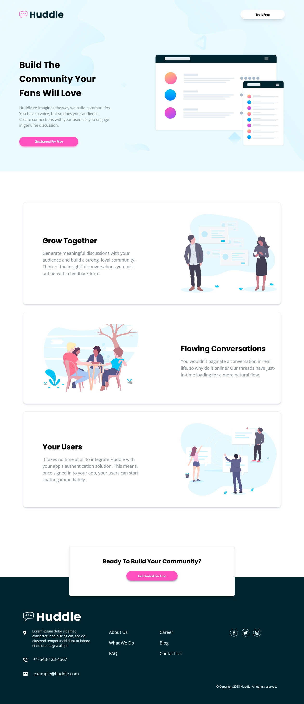

# Frontend Mentor - Huddle landing page with alternating feature blocks solution

This is a solution to the [Huddle landing page with alternating feature blocks challenge on Frontend Mentor](https://www.frontendmentor.io/challenges/huddle-landing-page-with-alternating-feature-blocks-5ca5f5981e82137ec91a5100).

## Table of contents

- [Overview](#overview)
  - [The challenge](#the-challenge)
  - [Screenshot](#screenshot)
  - [Links](#links)
- [My process](#my-process)
  - [Built with](#built-with)
  - [What I learned](#what-i-learned)
  - [Continued development](#continued-development)
  - [Useful resources](#useful-resources)
- [Author](#author)
- [Acknowledgments](#acknowledgments)

## Overview

### The challenge

Users should be able to:

- View the optimal layout for the site depending on their device's screen size
- See hover states for all interactive elements on the page

### Screenshot



### Links

- Solution URL: [@FrontendMentor.io](https://www.frontendmentor.io/solutions/huddle-landing-page-with-alternating-feature-blocks-with-tailwindcss-a4J9LRiOp)
- Live Site URL: [@Vercel](https://prj-15-huddle-landing-page-with-alternating-feature-blocks.vercel.app/)

## My process

### Built with

- Semantic HTML5 markup
- CSS custom properties
- Flexbox
- CSS Grid
- Mobile-first workflow
- [TailwindCSS](https://tailwindcss.com/) - CSS framework

### What I learned

I learned to use FontAwesome icons with TailwindCSS:

```html
<ul
  class="flex flex-nowrap items-center justify-center space-x-4 mt-16 lg:basis-1/3 lg:mt-0"
>
  <li class="social-icon"><i class="fab fa-facebook-f"></i></li>
  <li class="social-icon"><i class="fab fa-twitter"></i></li>
  <li class="social-icon"><i class="fab fa-instagram"></i></li>
</ul>
```

### Continued development

Future projects will be developed using Vue.JS when interactivity must be included.

### Useful resources

- [TailwindCSS Directives](https://tailwindcss.com/docs/functions-and-directives) - Use of @apply directive
- [Form states](https://tailwindcss.com/docs/hover-focus-and-other-states#form-states) - Style form elements in different states using modifiers like required, invalid, and disabled.
- [Customizing Colors in TailwindCSS](https://tailwindcss.com/docs/customizing-colors) - Adding personalized color names to be used in tailwindcss.
- [Customizing Fonts in TailwindCSS](https://tailwindcss.com/docs/font-family#using-custom-values) - Adding Google fonts to be used in tailwindcss.

## Author

- Website - [Gustavo Sanchez](https://www.gusanche.dev)
- Frontend Mentor - [@gusanchedev](https://www.frontendmentor.io/profile/gusanchedev)
- Github - [@gusanchedev](https://www.github.com/gusanchedev)
- Twitter - [@gusanchedev](https://www.twitter.com/gusanchedev)
- Linkedin - [gusanchedev](https://www.linkedin.com/in/gusanchedev/)

## Acknowledgments

Thanks to Mariapaz for being my friend and support 💙
